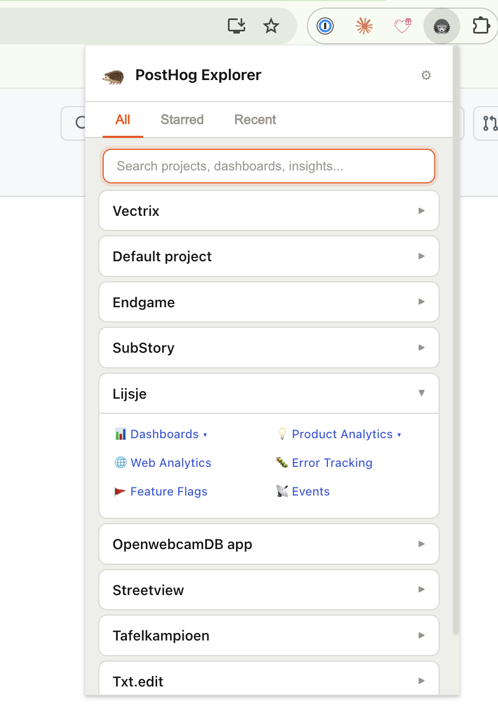

# 🦔 PostHog Explorer

A Chrome extension for quickly navigating your PostHog projects, dashboards, and insights.

> **Note:** This project is not affiliated with, endorsed by, or officially connected to PostHog in any way. It's an independent community tool.



## Features

- **Multi-org support** — See all your organizations and projects in one place
- **Quick access** — Jump to any PostHog tool (dashboards, insights, session replay, feature flags, etc.)
- **Dashboard & insight browser** — Expand to see individual dashboards and saved insights per project
- **Star favorites** — Star dashboards and insights for quick access in the Starred tab
- **Recent visits** — Track your recently visited PostHog pages
- **Search** — Filter across projects, dashboards, and insights
- **Per-project configuration** — Customize which tools are visible for each project
- **Drag-and-drop ordering** — Reorder organizations and projects in settings
- **Hide projects** — Hide projects or orgs you don't need
- **Flat list mode** — Optionally show all projects without org grouping
- **Light & dark mode** — Follows your OS preference
- **Self-hosted support** — Works with PostHog Cloud and self-hosted instances

## Installation

### Chrome Web Store

PostHog Explorer has been submitted to the Chrome Web Store and is pending review. Once approved, you'll be able to install it directly from there.

### Manual install (GitHub Release)

1. Download the latest `chrome-mv3-prod.zip` from the [Releases](https://github.com/TimBroddin/posthog-explorer/releases) page
2. Unzip the file
3. Go to `chrome://extensions` in Chrome
4. Enable **Developer mode** (top right)
5. Click **Load unpacked** and select the unzipped folder

## Setup

1. Click the hedgehog icon in your toolbar
3. Click "Open Settings"
4. Enter your PostHog instance URL (e.g., `https://eu.posthog.com`)
5. [Create a Personal API key](https://app.posthog.com/settings/user-api-keys) with scopes: `organization:read`, `project:read`, `dashboard:read`, `insight:read`
6. Paste the key and click "Test Connection"

## Development

Built with [Plasmo](https://www.plasmo.com/), React, and TypeScript.

```bash
# Install dependencies
pnpm install

# Start development server (hot reload)
pnpm dev

# Load in Chrome: go to chrome://extensions, enable Developer mode,
# click "Load unpacked", select the build/chrome-mv3-dev folder

# Production build
pnpm build

# Package for store submission
pnpm package
```

## Credits

Created by [Titans of Industry](https://www.titansofindustry.be)

- Hedgehog icon from [Twemoji](https://github.com/twitter/twemoji) (MIT License)
- Built with [Plasmo](https://www.plasmo.com/)
- Drag and drop powered by [@dnd-kit](https://dndkit.com/)

## License

MIT
